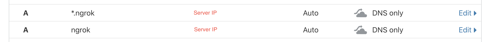

# Self Hosted Ngrok

> The Self Hosted Ngrok Be Used For AllJointNext

## Usage (Client)

1. Download the [ngrok v1 (MacOS)](./ngrok-client-release-build-go1.14.3.darwin-amd64.zip) client. **Or you can build the client yourself (see the Build the client section)**
2. Create Config (config.yaml) for personal use.

```sh
export DOMAIN='Set Your Domain Here'
eval "echo \"$(cat ./template.yaml)\"" > config.yaml
# Or move the config file to ~/.ngrok for global setting
# mv config.yaml ~/.ngrok
```

3. Ship your port

```sh
./ngrok -config=config.yaml start api # start-all
# Or
# ./ngrok -config=config.yaml start 3000
```

4. Finished
   

## Installation (Server)

### Debian 10 on GCP Compute Engine

1. update

```sh
sudo apt update
sudo apt upgrade
sudo apt autoremove
```

2. install tool

```sh
sudo apt install make git certbot
```

3. setup the ssl

```sh
export DOMAIN='Set Your Domain Here'
certbot -d ngrok.${DOMAIN} -d *.ngrok.${DOMAIN} --manual --preferred-challenges dns certonly
```

**Certbot will ask you add the DNS TXT record**

```sh
Please deploy a DNS TXT record under the name
_acme-challenge.ngrok.domain.com with the following value:

767drhmQL3vX6bu8YZlgy0eKNBlCny8yrjF1lSafndc

Once this is deployed,
Press ENTER to continue
```


4. setup the domain



5. install go

```sh
curl https://dl.google.com/go/go1.14.3.linux-amd64.tar.gz --output go1.14.3.linux-amd64.tar.gz
sudo tar -C /usr/local -xzf go1.14.3.linux-amd64.tar.gz
rm go1.14.3.linux-amd64.tar.gz
echo 'export PATH=$PATH:/usr/local/go/bin' >> $HOME/.profile
source $HOME/.profile
```

**check**

```sh
go -v
```

6. build server

```sh
git clone https://github.com/inconshreveable/ngrok.git
cd ngrok
make release-server
mv bin/ngrokd /usr/local/bin
```

7. setup the service

```sh
sudo echo \
'[Unit]
Description=ngrokd service
After=network.target
StartLimitIntervalSec=0
[Service]
Type=simple
Restart=always
RestartSec=1
User=root
ExecStart=/usr/local/bin/ngrokd -tlsKey="/etc/letsencrypt/live/${DOMAIN}/privkey.pem" -tlsCrt="/etc/letsencrypt/live/${DOMAIN}/fullchain.pem" -domain="${DOMAIN}"
[Install]
WantedBy=multi-user.target /etc/systemd/system/ngrokd.service' > /etc/systemd/system/ngrokd.service

systemctl start ngrokd
systemctl enable ngrokd
```

**check**

```sh
systemctl status ngrokd
```

8. setup Firewall

- name: allow-my-office
- direction: input
- actionType: allow
- ip range: your ip range
- tcp: 0-65535
- udp: 0-65535

9. finished

## Build the client

**install the go, git and make first**

```sh
git clone https://github.com/inconshreveable/ngrok.git
cd ngrok
make release-client
mv bin/ngrok /usr/local/bin
```

**check**

```sh
ngrok 80
```
